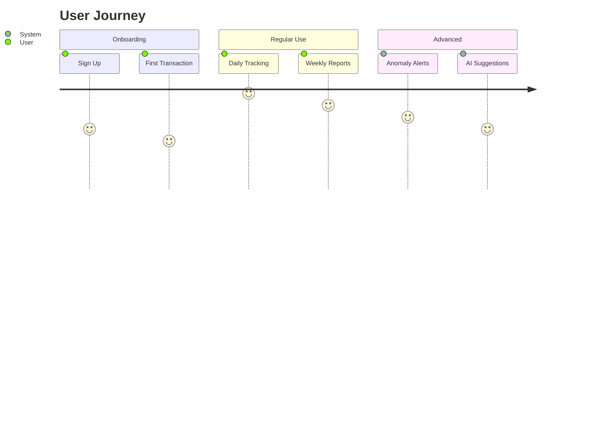
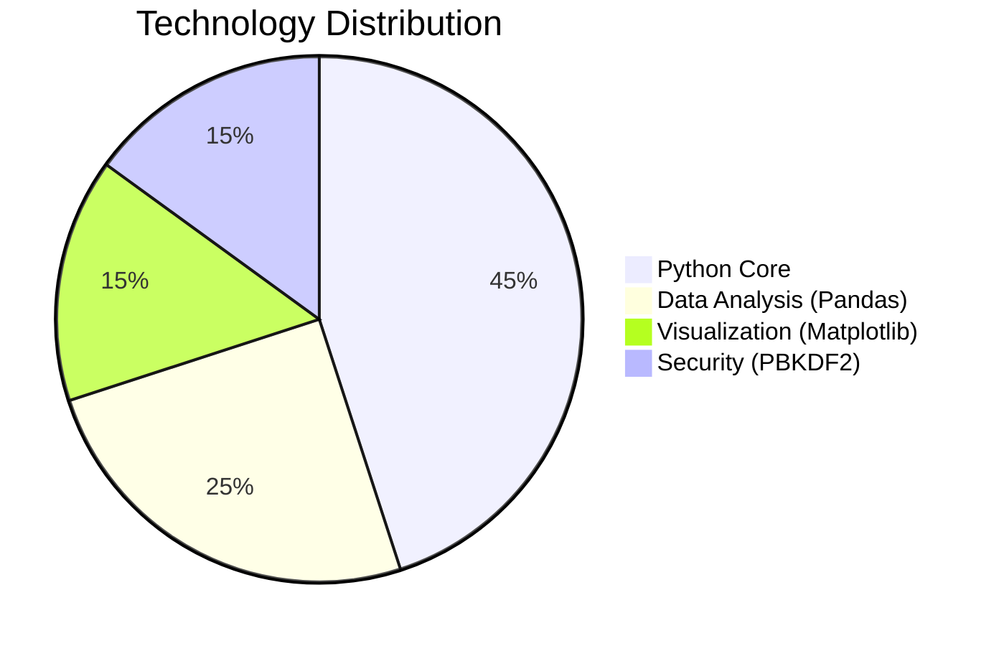

# 💸 AI-Powered Personal Finance Tracker 💳

  
<h2>Take Control of Your Money 💰</h2>

## 📌 Project Overview

**AI-Powered Personal Finance Tracker** is a comprehensive financial management solution designed to help users:

🔹 **Track expenses** with automatic categorization  
🔹 **Detect unusual spending** using machine learning  
🔹 **Generate insights** through interactive visualizations  
🔹 **Secure financial data** with military-grade encryption  

### Core Capabilities:
- **Multi-account support**: Manage all your finances in one place
- **Cross-platform access**: Desktop app with upcoming mobile version
- **Data privacy**: All data stored locally with optional cloud sync
- **Extensible architecture**: Plugin system for custom integrations

## 🌟 Why Choose Our Tracker?

  
✨ **All-in-One Financial Management** ✨  
💯 **100% Private & Secure** 🔒  
🚀 **Built for Everyone - From Students to CEOs** 👩‍🎓👨‍💼

## 🎯 Key Features

| | Feature | Technical Details |
|-|---------|-------------------|
| 🔐 | **Security** | PBKDF2 + SHA512, 700ms hash delay |
| 📊 | **Smart Insights** | NLP-based transaction categorization |
| 🚨 | **Fraud Detection** | Z-score analysis + moving averages |
| 📱 | **Dashboard** | Tkinter with 60FPS animations |
| 🤖 | **AI Engine** | Scikit-learn + custom forecasting models |

## 🛠️ Tech Stack Deep Dive

## 🚀 One-Click Setup

## 📜 License

This project is licensed under the **[MIT License]** - see the [LICENSE](LICENSE) file for full details.

[MIT License]: https://opensource.org/licenses/MIT

---

  
## 🌐 Connect with Me

  
  
  
  

