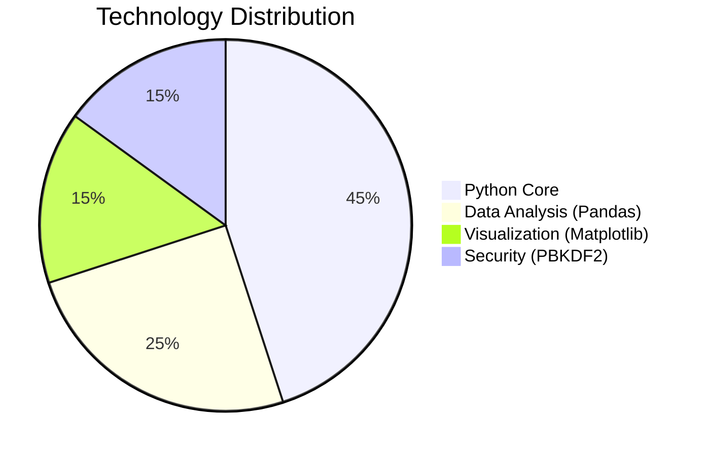
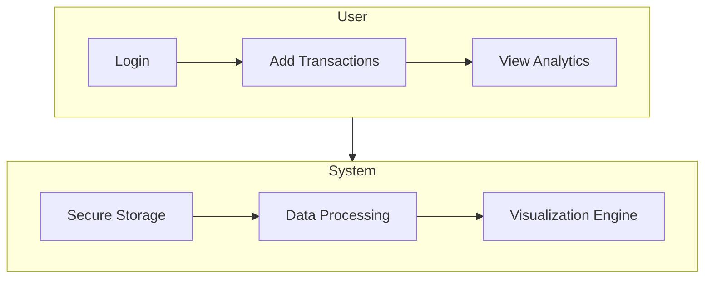

# 💸 AI-Powered Personal Finance Tracker 💳

  
<h2>Take Control of Your Money 💰</h2>

## 🌟 Why Choose Our Tracker?

  
✨ **All-in-One Financial Management** ✨  
💯 **100% Private & Secure** 🔒  
🚀 **Built for Everyone - From Students to CEOs** 👩‍🎓👨‍💼

## 🎯 Key Features

| | Feature | Description |
|-|---------|-------------|
| 🔐 | **Military-Grade Security** | PBKDF2 + SHA512 encryption |
| 📊 | **Smart Insights** | Auto-categorization + spending patterns |
| 🚨 | **Fraud Detection** | Real-time anomaly alerts |
| 📱 | **Beautiful Dashboard** | Clean, intuitive interface |
| 🤖 | **AI Assistant** | (Coming Soon) Financial advice |

## 🛠️ Tech Stack Deep Dive

## 🚀 One-Click Setup

## 📊 Data Flow Architecture

## 📜 License

This project is licensed under the **[MIT License]** - see the [LICENSE](LICENSE) file for full details.

[MIT License]: https://opensource.org/licenses/MIT

---

  

## 🌐 Connect with Me

  
  
  

